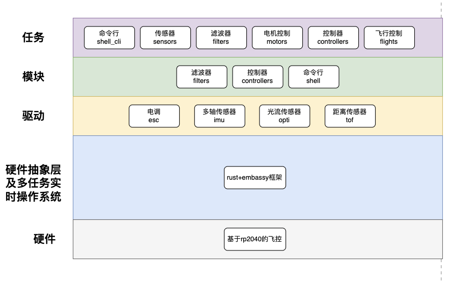

# 基于rp2040的四旋翼飞控固件(embassy框架版本)
- 参考[https://github.com/peterkrull/quad]和[https://github.com/holsatus/holsatus-flight]

## 项目目录
1. .cargo : 编译器配置
2. cargo-generate : (忽略)
3. docs : 相关文档
4. examples : 示例例程
5. src : 代码目录
6. static : 部分库代码
7. target : 编译产物
8. tests : 总体测试代码
9. vendor : 所有依赖库
10. Cargo.toml : 项目配置
11. memory.x : MCU内存分配
12. rust-toolchain.toml : 编译器版本配置
13. assets : 截图和开发参考代码

## 使用说明
使用串口(usb_cdc)命令行操作飞控:
- usbmodem666666661, 通信参数: 115200, 8N1
- 另一个usbmodem666666663暂未用到

**上电后就会自动让四个电机保持低速旋转, 没有arm(解锁)**

```sh
# 打印帮助信息
help
# Basic commands:
#  clear   Clear the shell output, `clear`
#  logo    Show the logo graphic, `logo`
#  blink   Blink commands, `blink`
#  greet   Hello commands, `greet`
#  go      go commands, `go`, example: go move forward 1, go take_off
#  motor   motor commands, `motor`
#  sensor  sensor commands, `sensor`, example: sensor get micoair

# 起飞(100cm离地高度)
go take_off 100
# 降落
go landing
# 直接控制1#电机转速到100(100不是最大转速)
motor set speed 1 100
# 获取传感器数据
sensor get imu
```

## 开发说明
### 代码文件
1. drivers : 外设驱动(imu, esc)
    - imu : 惯性传感器单元
        * mpu6050.rs : mpu6050六轴传感器
        - atk_imu901 : 正点原子ATK-IMU901十轴传感器驱动
          * defines.rs : 数据结构定义
          * utils.rs : 工具函数
          - functions : 解析数据函数
            * atk_ms901m.rs : 处理帧数据并整合为imu数据
            * frame_state_machine.rs : 帧解析状态机
    - esc : 电子调节器(电调)
        * little_bee.rs : 小蜜蜂电调
        * micoair_4in1.rs : 微空四合一电调
    - optical_flow : 光流位移传感器
        * micoair_mtf02p.rs : 微空MTF-02P光流传感器
    - tof : ToF距离传感器
        * benewake_tflc02.rs : 北醒TF-LC02激光测距传感器
2. modules : 紧耦合算法模块
    - controllers : 控制器
      - lqr : lqr线性二次调节控制器
        * lqr.rs : 实际的控制代码
    - filters : 滤波器
        - estimators : 位置估计(位移追踪)滤波器
            * extended_kalman.rs : 扩展卡尔曼滤波器
            * linear_kalman.rs : 线性卡尔曼滤波器
        * baro_altitude_fusion_filter.rs : 气压高度融合滤波器
        * mean_filter.rs : 平均值滤波器
    - errors : 错误处理
    - calibration : 传感器校准/标定
    - shell : 命令行交互
        * mod.rs : 定义run_cli接口
        * ubuffer.rs : 自定义的u8 buffer字符串处理
        * writer_sync.rs : 同步写入器
        * usb_adapter.rs : 适配到USB_CDC的读取/写入
        - commands : 命令定义
            * hello.rs : 定义hello命令
            * blink.rs : 闪灯命令
            * go.rs : 运动控制命令
            * motor.rs : 电机直接控制命令
            * sensor.rs : 传感器控制命令
    - mavlink2 : mavlink2协议栈
    - sbus : sbus协议栈
    - modelica : modelica建模语言(Model Based Design)
3. tasks : 任务
    * blink.rs : led指示灯任务
    * circling.rs : 空中绕圈任务
    * demo.rs : 演示任务:起飞->盘旋->降落
    * landing.rs : 降落任务
    * logging.rs : 日志黑匣子任务
    * motors.rs : 电机控制任务@ESC
    * moving.rs : 空中前进后退左右移动任务
    * shell_cli.rs : 命令行解析任务
    * take_off.rs : 起飞任务
    * usb.rs : usb总线处理任务
    * motor_test.rs : 测试分别旋转四个电机任务
    * hovering.rs : 悬停任务
    * filters.rs : 滤波器任务
    * controllers.rs : 控制器任务
    * sensors.rs : 传感器任务
    * tests.rs : 测试核心算法任务
4. utils : 工具
    * consts.rs : 常量
    - types : 类型
      * flight.rs : 飞行状态控制类型
      * sensor.rs : 传感器数据类型
    - signals : 信号量
    * variables.rs : 全局变量
5. applications : 顶层应用程序
6. main.rs : 飞控程序总入口

### 添加新功能流程
1. drivers添加硬件驱动(可选)
2. tasks添加异步任务
3. utils::signals添加任务间通信的信号通道(订阅/发布模型)(可选)
4. shell::commands添加调用命令(可选)
5. main.rs启动任务

### 代码运行逻辑
* main.rs -> tasks -> modules

|飞控架构图|
|-----------------------------------|
||

上电就自动启动多个任务, 任务持续监听任务消息, 然后自动执行.例如命令行接收到`go take_off 100`, 调用take_off_task任务, 获取sensor_task任务的数据和使用filter_task对传感器数据进行初步处理和融合, 计算出参数后使用controllers模块的代码控制四个电机旋转从而起飞.

### 主要使用的第三方库
1. embassy : 用于多任务及异步控制(RTOS平替方案?)
  * embassy_rp
2. paste : 宏编程
3. libm, nalgebra : 数学计算
4. embedded-cli : 命令行
5. ufmt : no_std的字符串处理
6. defmt : 调试信息打印
7. panic-probe : 连接probe-rs工具
8. serde : 字符串序列化
9. static_cell : 变量生命周期管理
10. heapless : 内存分配

## 无人机构型
```rs
/// 四旋翼 "x" 构型
/// 
///   正面
/// M4     M2
///   \   /
///     |
///   /   \
/// M3     M1
/// 
/// 解释: \
/// `M1` spins CW(正桨) \
/// `M2` spins CCW(反桨) \
/// `M3` spins CCW(反桨) \
/// `M4` spins CW(正桨) \
```

## 原理图接线
- MICO_RX2 : GP2
- MICO_CURR : GP3
- ATK_RX : GP4
- ATK_TX : GP5
- ATK_D0 : GP6
- ATK_D1 : GP7
- ATK_D2 : GP8
- TF_TX : GP10
- TF_RX : GP11
- MICO_TX : GP12
- MICO_RX : GP13
- DSHOT_1 : GP14
- DSHOT_2 : GP15
- DSHOT_3 : GP16
- DSHOT_4 : GP17
- MICO_M1 : GP18
- MICO_M2 : GP19
- MICO_M3 : GP20
- MICO_M4 : GP21
- SUB_RX : GP26
- SUB_TX : GP27
- LED : GP25
